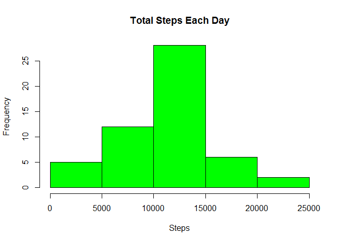

# Reproducible Research - Course Project 1
Bosun Sogeke  
`r format(Sys.Date())`  

## Loading and preprocessing the data
1. Loading Data

```r
library(ggplot2)
```

```
## Warning: package 'ggplot2' was built under R version 3.2.4
```

```r
library(plyr)
```

```
## Warning: package 'plyr' was built under R version 3.2.4
```

2. Processing Data
Check if files exist, if not, unzip file and load data into a dataframe

```r
if(!file.exists("activity.csv")) {
  if(file.exists("repdata-data-activity.zip")) {
    unzip("repdata-data-activity.zip")
    unlink("repdata-data-activity.zip")
  } else {
    stop("File repdata-data-activity.zip cannot be found in current directory.")
  }
}

activityData <- read.csv("activity.csv")
```


## What is mean total number of steps taken per day?


```r
stepsTakenByday <- aggregate(steps ~ date, activityData, sum)
hist(stepsTakenByday$steps, main = paste("Total Steps Each Day"), col="green", xlab="Steps")
```



```r
currMean <- mean(stepsTakenByday$steps)
paste("The average number of steps taken each day is ", floor(currMean))
```

```
## [1] "The average number of steps taken each day is  10766"
```

```r
currMedian <- median(stepsTakenByday$steps)
paste("The median number of steps taken each day is ", floor(currMedian))
```

```
## [1] "The median number of steps taken each day is  10765"
```

## What is the average daily activity pattern?
1. Calculate average steps for each interval for all days.

```r
avgStepsByInterval <- aggregate(steps ~ interval, activityData, mean)
```

2. Plot the Average Number Steps per Day by Interval.

```r
plot(avgStepsByInterval$interval,avgStepsByInterval$steps, type="l", xlab="Interval", ylab="Number of Steps",main="Average Number of Steps per Day by Interval")
```


3. Find interval with most average steps.


```r
mostAvgSteps <- avgStepsByInterval[which.max(avgStepsByInterval$steps),1]
paste("The interval with the most average steps is ", floor(mostAvgSteps))
```

```
## [1] "The interval with the most average steps is  835"
```


## Imputing missing values
1. Get a copy of the clean data i.e data with no NAs

```r
dataWithNoNAs <- activityData[!is.na(activityData$steps),]
```

2. Calculate and report the total number of missing values in the dataset (i.e. the total number of rows with NAs)

```r
rowsWithNAsteps <- nrow(activityData[is.na(activityData$steps),])
paste("The total number of rows with steps = 'NA' is ", floor(rowsWithNAsteps)) 
```

```
## [1] "The total number of rows with steps = 'NA' is  2304"
```

3. Devise a strategy for filling in all of the missing values in the dataset. The strategy does not need to be sophisticated. For example, you could use the mean/median for that day, or the mean for that 5-minute interval, etc.

```r
## Create the average number of steps per weekday and interval
incomplete <- sum(!complete.cases(activityData))
imputed_data <- transform(activityData, steps = ifelse(is.na(activityData$steps), avgStepsByInterval$steps[match(activityData$interval, avgStepsByInterval$interval)], activityData$steps))
```

4. My strategy for filling in NAs will be to substitute the missing steps with the average 5-minute interval based on the day of the week.

```r
imputed_data[as.character(imputed_data$date) == "2012-10-01", 1] <- 0
```

5. Recount total steps by day

```r
newDaySteps <- aggregate(steps ~ date, imputed_data, sum)
hist(newDaySteps$steps, main = paste("Total Steps Each Day"), col="blue",
     xlab="Number of Steps")

# Create Histogram to show difference. 
hist(stepsTakenByday$steps, main = paste("Total Steps Each Day"), col="red",
     xlab="Number of Steps", add=T)
legend("topright", c("Imputed", "Non-imputed"), col=c("blue", "red"), lwd=10)
```


6. Calculate new mean and median for imputed data.

```r
calNewMean <- mean(newDaySteps$steps)
paste("New mean value is ",floor(calNewMean) )
```

```
## [1] "New mean value is  10589"
```

```r
calNewMedian <- median(newDaySteps$steps)
paste("New median value is ",floor(calNewMedian) )
```

```
## [1] "New median value is  10766"
```

7. Calculate difference between imputed and non-imputed data.

```r
meanDiff <- calNewMean - currMean
paste("The difference between the non-imputed mean and imputed mean is ", floor(meanDiff) )
```

```
## [1] "The difference between the non-imputed mean and imputed mean is  -177"
```

```r
medianDiff <- calNewMedian - currMedian
paste("The difference between the non-imputed median and imputed median is ", floor(medianDiff) )
```

```
## [1] "The difference between the non-imputed median and imputed median is  1"
```
## Are there differences in activity patterns between weekdays and weekends?
Created a plot to compare and contrast number of steps between the week and weekend. There is a higher peak earlier on weekdays, and more overall activity on weekends.


```r
weekDays <- c("Monday", "Tuesday", "Wednesday", "Thursday", "Friday")
imputed_data$dow = as.factor(ifelse(is.element(weekdays(as.Date(imputed_data$date)),weekDays), "Weekday", "Weekend"))

stepsByInterval <- aggregate(steps ~ interval + dow, imputed_data, mean)

library(lattice)

xyplot(stepsByInterval$steps ~ stepsByInterval$interval|stepsByInterval$dow, main="Average Steps per Day by Interval",xlab="Interval", ylab="Steps",layout=c(1,2), type="l")
```


